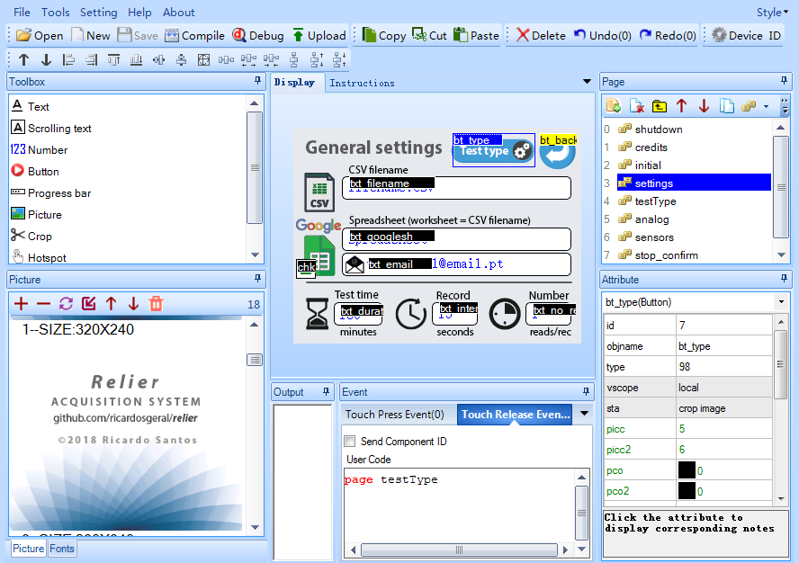
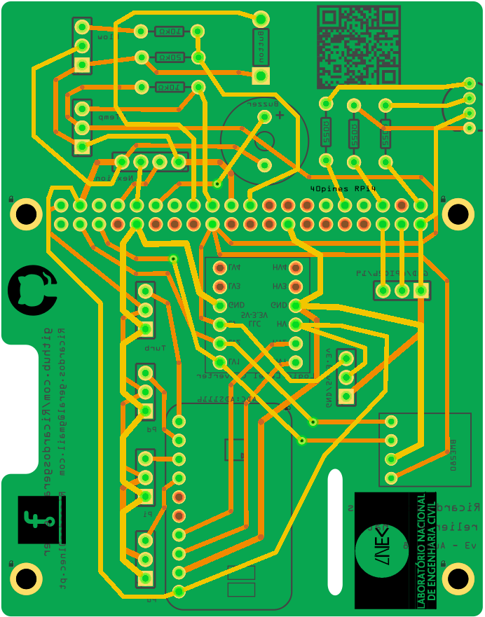
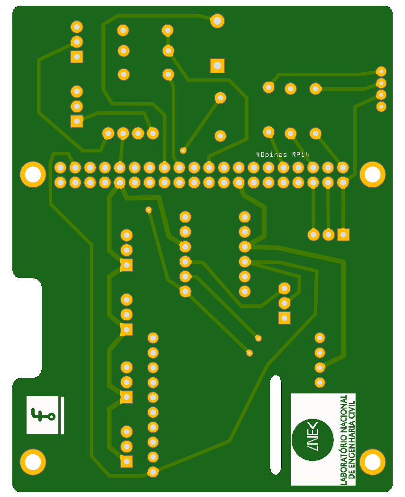
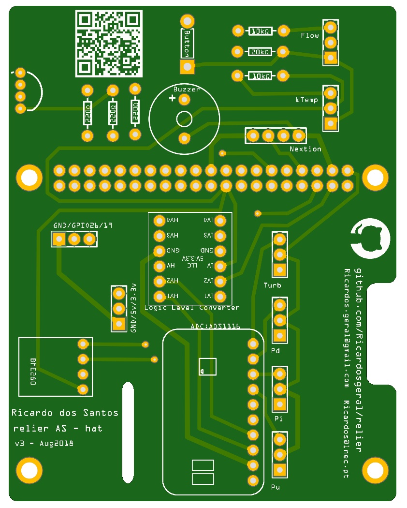
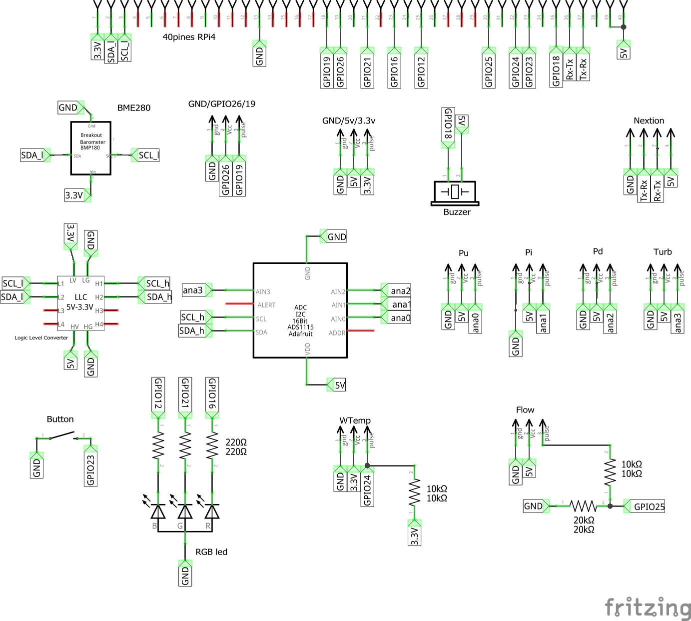
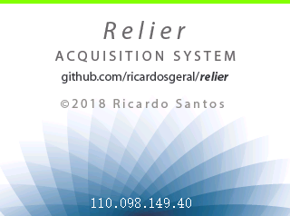
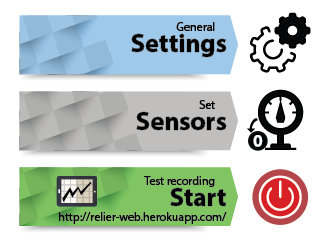
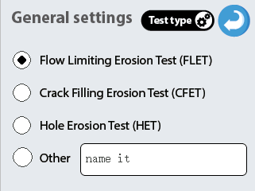
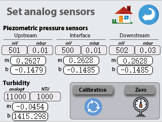
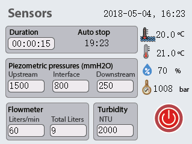

# *relier - acquisition system*
### Open {*re*}design of an acquisition system for {*l*}aboratory tests on {*i*}nternal {*er*}osion in soils

Project developed by [*Ricardo Correia dos Santos*](https://www.linkedin.com/in/ricardons/) at 
[Laboratório Nacional de Engenharia Civil - *LNEC*](http://www.lnec.pt/en/), in Lisbon, Portugal

### About the author and the *relier* project
I'm a Civil Engineer, with a [master degree](https://www.researchgate.net/publication/273715929_Enquadramento_das_analises_de_riscos_em_Geotecnia) 
in risk analysis in Geotechnical Engineering, and a [PhD](https://www.researchgate.net/publication/265396445_Experimental_investigation_on_limitation_of_the_progression_of_internal_erosion_in_zoned_dams?_sg=TYpuvUDlOEmsy1nkmycUNZZQmLHo34eFR1un5kQBsel1Ih6m8itcptNphw4q33ZLbFPsnKm5uX3PfaJmW1fljV7_goXnxDN4Ne4RwewR.OOCKioxBNPJoOd0B8BiFk4-Dqk849OZdMI_lxDR_IRduPQ88ovShdBBoVm34ZNhMTA_UT3M8PANv1KdYr7rMXg) 
on internal erosion in embankment dams.
 
Carrying out the [laboratory tests on internal erosion in soils](https://www.researchgate.net/publication/317742058_Limitation_of_the_progression_of_internal_erosion_in_zoned_dams), 
developed in my PhD, 
requires to simultaneously collect different types of measurements (water pressures, flow rate, temperature, turbidity, ...).
The measurements had to be registered by hand, in regular intervals, by two operators!! 
Such manual process is tedious and prone to errors.

So, I've decided to invest time developing a 'low budget' acquisition system (hardware and software) that could 
collect data automatically from multiple analog and digital output sensors. 
*relier* born this way!

You can find pictures and an overview video of ***relier AS*** in this GitHub repo in [Media folder](/Media).

Please note that I'm not an expert in informatics, in computing, nor in electronics.
I define myself as an enthusiastic self learner. 
All shown here was developed from my own research, mainly on forums, Github and other websites.
Thus, it is possible that some things (code, connections, methods...) could be optimized, or done in a different or better way. 
Yet, ***relier*** *acquisition system* performs as intended.
You can report bugs, suggest enhancements, or even fork the project on [Github](https://github.com/Ricardosgeral/relier). 
All contributions are welcome.


### Is this for me?
If you need to do a similar project, you just need to have some DIY skills, for scrapping some materials, figuring out 
how to assemble some things together, and investigate how some components work. 
The instructions given here should also be taken more like guidelines based on "what I can do with the materials I have". If 
you do not have the exact same hardware components 
(sensors, ADC, level shifter, touchscreen...), yours will surely work a little different, but as they should do the same 
things, there will be similarities too. You may have to adjust the code and/or the connections to meet your needs.

Feel free to contact me if you manage to get it working with different components, so these instructions can be improved 
and be more helpful. 


## Software installation

The software of  ***relier*** *acquisition system* is composed by two distinct but interconnected major parts,
running in two different *hardware* components, particularly in the:
1. **Server** (*Raspberry Pi 3B*), which performs the computation tasks, and
2. **Touchscreen** (*Nextion device*), responsible by the interactivity between the end user and the server.


### Server software
The server is a Raspberry Pi 3 model B. These instructions should be carried out after a fresh installation of *Raspbian* image in a Micro SD card 
(see [instructions](https://www.raspberrypi.org/documentation/installation/installing-images/README.md)). 
The server has been tested with [2018-06-27-raspian-stretch](http://downloads.raspberrypi.org/raspbian/images/raspbian-2018-06-29/). 
Most of the code is written in *Python v3.5.3*, and a few scripts are written in *Bash v4.4.12(1)*.

**Note:** If no monitor is available (*Raspberry Pi* headless setup), the following 4 simple steps are required to 
enable *SSH* in first boot. So, right after installing the Raspbian image in the  Micro SD card:
1. Create an empty file (in Windows use notepad, in a Linux terminal use command *touch*, in Mac use TextEdit).
2. Save the file with name: ***ssh*** (preferentially with no extension, but *ssh.txt* should also work).
3. Copy or move that file into the ***root*** of the Micro SD card, where Raspbian image is installed.
4. Insert the Micro SD card into the *Raspberry Pi*, and power it on.

Access the *Raspberry Pi* directly (if you have a monitor), or via *SSH* (for example, using [*Putty*](https://www.putty.org/)). 
In this last option, you will require an internet connection, and need to know the local IP attributed to the *Raspberry Pi* ! 
The default login parameters should be:

   username: `pi`   
   password: `raspberry`

It is recommended to change the password after first boot, since *SSH* is enabled! For that write down in the terminal

    $ passwd 
    
and choose your new password.

Now, if you haven't done it yet, you need to connect the *Raspberry Pi* to the internet (via Ethernet cable or [WiFi](https://www.raspberrypi.org/documentation/configuration/wireless/wireless-cli.md)).  
Then, in the terminal, run the following sequential commands:
    
    $ cd /tmp && wget https://raw.githubusercontent.com/Ricardosgeral/relier/master/bash/raspbian-post-install.sh
    $ sudo chmod +x raspbian-post-install.sh && sed -i 's/\r//' raspbian-post-install.sh
    $ sudo ./raspbian-post-install.sh

Prepare a big cup of hot tea, since this can take some minutes ! The raspberry should reboot automatically!

**Note:** During installation of the server, [VNC](https://www.realvnc.com/en/raspberrypi/) is also enabled, 
case you want to use it. 


#### Google Credentials

***relier AS*** has the ability to send the main test results to google sheets, but, for that, it requires some configurations.
If you don't need this feature you can skip it.

After reboot of the RPI, you need to get your *json* file with your Google Signed credentials.
First, you need to create a project in the developer console and enable some APIs (follow steps 1 to 4 from these [instructions](https://pygsheets.readthedocs.io/en/latest/authorizing.html#)), 
then, get the *Signed credentials* (follow steps 5 and 6 from these [instructions](https://pygsheets.readthedocs.io/en/latest/authorizing.html#signed-credentials)). 
*Copy* your Signed credentials, then, do:

    $ sudo nano /home/pi/relier/service_creds.json
    
and *Past* the Signed credentials. `Ctrl+X`, then `y` and finally `Enter` to save file.

    $ sudo reboot


And that's it, after reboot, the *Raspberry Pi* is set properly. 
However, you still need to update the  **Touchscreen software**, and set the **Hardware** correctly!

### *Touchscreen* software

The graphical user interface (GUI) runs on a [*Nextion*](https://nextion.itead.cc/) smart touchscreen, 
also referred as an *HMI - Human Machine Interface*. 
Note that, this device does not work like typical TFT or HDMI monitors. 
A code needs to be developed and uploaded to the device using a Micro SD card. 
The connection between *Nextion device* and the *Raspberry Pi* is made via 
[*Serial UART*](https://www.allaboutcircuits.com/technical-articles/back-to-basics-the-universal-asynchronous-receiver-transmitter-uart/), 
that is, via serial communication in pins GPIO14 (TXD) and GPIO15 (RXD) (in all Raspberry models).

The GUI needs to be developed in the [Nextion Editor](https://nextion.itead.cc/resources/download/nextion-editor/) (free software - only for windows!).
Follow the [Nextion Editor Guide](https://nextion.itead.cc/editor_guide/) to learn how to work with it. 
I've provide the file [*relier.HMI*](https://github.com/Ricardosgeral/relier/blob/master/Nextion/HMI/relier.HMI) 
developed for this project. The next picture shows the Nextion Editor with the project file.



To upload the code into *Nextion touchscreen* follow these steps:

1. Open the file [*relier.HMI*](https://github.com/Ricardosgeral/relier/blob/master/Nextion/HMI/relier.HMI) 
with the Nextion Editor.
2. Press the *Compile* icon in the first top bar, and check that there are no errors.
3. Go to *File > Open build folder* and copy the *relier.tft* file produced by the editor (that has the code). 
4. Past the file into a micro SD card ***without*** any files (first I recommend using the windows format tool, 
to ensure all files are cleared from the card).
5. Disconnect the power supply to *Nextion*.
6. Insert the micro SD card in the slot on the back of the device.
7. Reconnect the power supply to *Nextion*. You should see the *SD card update* status. 
If you see `Check data.. 100%`, the code was uploaded successfully.  
8. Disconnect again the power supply to the screen, and remove the micro SD card (it will not be necessary anymore).
9. In next start up, the software with the code made by the Nextion Editor is running in the device, 
and the GUI is set on the touchscreen.

**Note:** Be very careful when buying the *Nextion* device. Confirm that you are not getting a *TJC* (for the Chinese market), 
which looks identical. 
*TJC* screens only work with the Chinese version of the Nextion Editor! You will need to learn Chinese to use it !!!!
 
 
## Hardware

The hardware components required to make the ***relier*** *acquisition system* are indicated here. 
Instructions about the way those components are connected are also presented.
Just for reference, some links and prices of the components are also presented.

The fundamental *Hardware* is composed by the:
1. ***Server*** [Raspberry Pi 3 model B](https://www.raspberrypi.org/products/raspberry-pi-3-model-b/) [35 €],
2. ***Touchscreen***[Nextion 2.8" - NX3224T028](https://www.itead.cc/nextion-nx3224t028-1932.html) [16 €]
3. ***2 layers custom PCB (Raspberry  hat)*** (design details [below](https://github.com/Ricardosgeral/relier/blob/master/README.md#printed-circuit-board-pcb-designedproduced)) [12 €], and
4. ***Sensors*** (4 with analog outputs, and 3 with digital outputs).

The server, the touchscreen and the custom PCB are placed inside an aluminum enclosure [(88x38x100mm box profile)](https://www.aliexpress.com/item/Free-shipping88-38-100mm-width-x-high-x-length-aluminum-extrusion-box-profile-enclosure-for-PCB/32800855972.html?spm=a2g0s.9042311.0.0.Wvmz38) [6 €].

The following picture shows all the hardware involved.


You can find more pictures and an overview video in this GitHub repo in [Media folder](/Media).


### Additional hardware 
#### For the Raspberry Pi server

+ 1x [micro SD card (> 8 GB)](https://www.aliexpress.com/item/SAMSUNG-Micro-SD-Card-256G-128GB-64gb-32g-100M-s-Class10-U3-4K-UHD-Memory-card/32813615707.html?spm=a2g0s.9042311.0.0.Xdt3Ob) [12 €]
+ 1x [Raspberry Pi Universal Power Supply or equivalent](https://www.raspberrypi.org/products/raspberry-pi-universal-power-supply/) [15 €]

#### For the Nextion touchscreen
+ 1x micro SD card (>128 MB, only required for installation) [< 5 €]


#### For the  2 layers custom PCB (raspberry hat) 

+ 1x [***16 Bit I2C ADS1115*** Module ADC 4 channel with Pro Gain Amplifier](https://www.aliexpress.com/item/16-Bit-I2C-ADS1115-Module-ADC-4-channel-with-Pro-Gain-Amplifier-RPi-1PCS/32817162654.html?spm=a2g0s.9042311.0.0.KZKf8O) [2 €]
+ 1x [***Logic Level Shifter*** Bi-Directional 5V to 3.3V](https://www.aliexpress.com/item/5PCS-Logic-Level-Shifter-Bi-Directional-For-Arduino-5V-to-3-3V-Four-Way-Two-Way/32827270848.html?spm=a2g0s.9042311.0.0.PRV9iC) [2 €]
+ 6x [8mm Male & Female Connector miniature Aviation Plug M8 Circular Socket+Plug](https://www.aliexpress.com/item/1PCS-AP049-YC8-2-3-4-5-6-7Pin-8mm-Male-Female-Connector-miniature-Aviation-Plug/32845374887.html?spm=a2g0s.9042311.0.0.6sphAY) [6x4= 24 €]
+ 6x [XH2.54 3-Pins connectors with right angle Male for PCB - Header+Housing+Terminal](https://www.aliexpress.com/item/XH2-54-2P-3P-4P-5P-6P-7P-8P-9P-10P-11P-12P-13P-14P-15P/32793262315.html?spm=a2g0s.9042311.0.0.DEz5gr) [3 €]
+ 1x [2.54mm 2x20 DC3 40 Pin Right Angle Male for PCB](https://www.aliexpress.com/item/10pcs-2-54mm-2x20-DC3-40-Pin-Right-Angle-Male-Shrouded-PCB-IDC-Socket-Box-header/32597308721.html?spm=a2g0s.9042311.0.0.y1HFgb) [4 €]
+ 1x [Momentary pushbutton switch 3A Reset Button](https://www.aliexpress.com/item/10pcs-Momentary-Push-Button-Switch-12mm-Momentary-pushbutton-switches-3A-125VAC-1-5A-250VAC-Reset-Button/32802331189.html?spm=a2g0s.9042311.0.0.1PWJGq) [2 €]
+ 1x 5 mm RGB LED [< 1 €]
+ 1x Active Buzzer Alarm 5 V  [< 1 €]
+ 3x 220 Ω carbon film resistor [< 1 €]
+ 2x 10 kΩ carbon film resistor [< 1 €]
+ 1x 20 kΩ carbon film resistor [< 1 €]
+ 1x 4 pins Male Single Row Pin Header Strip [< 1 €]
+ 6 x 5 cm cable with 3 wires [< 1 €]


### Custom *PCB* design
This PCB (Printed circuit board) links together the server, the touchscreen and the sensors. 
The design of the 2 layer's *PCB* was developed using [Fritzing](http://www.fritzing.org/). 
The production files and the *.fzz* file are [here](https://github.com/Ricardosgeral/relier/tree/master/Fritzing). 
Latest version of *PCB* is v3. 
The *PCB* was produced/printed by [PCBWay company](https://www.pcbway.com/).

Below, you can see images showing the circuits hooked in the breadboard and in the PCB, as well as the final 
aspect of each *PCB* layer individually. 
[Here](https://www.raspberrypi-spy.co.uk/2012/06/simple-guide-to-the-rpi-gpio-header-and-pins/#prettyPhoto/1/)
you can see the numbering of the 40 GPIO pins of the Raspberry Pi used.

**Fritzing: breadboard view**


**Fritzing: PCB view**



**PCB: top layer**


**PCB: bottom Layer**


**Fritzing: scheme**



### Sensors

The following ***'low cost' sensors*** were used:
+ 3x [***Analog Pressure Transducer Transmitter Sensor***, 0-5psi 0.5-5V](https://www.aliexpress.com/item/1Pc-Pressure-Transducer-Sender-Stainless-Steel-for-Oil-Fuel-Air-Water-5psi-CSL2017/32814346612.html?spm=2114.search0104.3.34.61855791WWOsT5&ws_ab_test=searchweb0_0,searchweb201602_1_10152_10151_10065_10344_10068_10342_10343_5722611_10340_10341_10698_10696_5722911_5722811_10084_5722711_10083_10618_10304_10307_10301_5711211_10059_308_100031_10103_10624_10623_10622_10621_10620_5711311_5722511,searchweb201603_32,ppcSwitch_5&algo_expid=a59a0ef4-feff-4b1a-b341-8883ad49d5dc-5&algo_pvid=a59a0ef4-feff-4b1a-b341-8883ad49d5dc&transAbTest=ae803_2&priceBeautifyAB=0) [3x13= 39 €]
+ 1x [***Digital Turbine Flow Sensor***, 1.5" DN40 2~200L/min](https://www.aliexpress.com/item/1-5-DN40-2-200L-min-water-Plastic-Hall-Turbine-flow-sensor-industry-meter/32445746581.html?spm=a2g0s.9042311.0.0.lPAUbg) [13 €]
+ 1x [***Analog Turbidity Sensor***, 5V 40mA](https://www.aliexpress.com/item/DFRobot-Gravity-Analog-Digital-Turbidity-Sensor-5V-40mA-DC-support-both-signal-output-compatible-with-arduino/32595773560.html?spm=a2g0s.9042311.0.0.dGtxdp) [9 €]
+ 1x [Waterproof DS18B20 digital Temperature Sensor (probe)](https://www.aliexpress.com/snapshot/0.html?spm=a2g0s.9042311.0.0.oXghXt&orderId=505161631680030&productId=32675444739) [<1€]
+ 1x [BME280 Digital Sensor, Humidity, Temperature and Barometric Pressure Sensor](https://www.aliexpress.com/item/3In1-BME280-GY-BME280-Digital-Sensor-SPI-I2C-Humidity-Temperature-and-Barometric-Pressure-Sensor-Module-1/32659765502.html?spm=a2g0s.9042311.0.0.oXghXt) [3 €]

Most of the sensors are connected to the acquisition system box via the mini aviator (circular) plugs. An exception is the 
*BME280* chip, which is soldered directly into the PCB. If possible this chip should be placed with the sensor pointing to the exterior of the AS box (with an opening), 
to minimize the influence of the heat generated by the monitor!

#### Other components that may be useful for debugging
+ Breadboard(s)
+ [T-cobbler for raspberry pi](https://www.aliexpress.com/item/830-tie-points-MB102-breadboard-40Pin-Rainbow-Cable-GPIO-T-Cobbler-Plus-Breakout-Board-Kit-for/32673580640.html?spm=2114.search0104.3.9.6581309ai8NJdY&ws_ab_test=searchweb0_0,searchweb201602_1_10152_10151_10065_10344_10068_10342_10343_5722611_10340_10341_10698_10696_5722911_5722811_10084_5722711_10083_10618_10304_10307_10301_5711211_10059_308_100031_10103_10624_10623_10622_10621_10620_5711311_5722511,searchweb201603_32,ppcSwitch_5&algo_expid=3ed88c37-67f1-4fe2-a688-b3983db90ff7-1&algo_pvid=3ed88c37-67f1-4fe2-a688-b3983db90ff7&transAbTest=ae803_2&priceBeautifyAB=0)
+ DuPont jumper wires
+ Micro SD adapter
 
#### Additional tools required for the assemblage of the PCB and AS box
+ Wire Stripper/Crimping tools
+ Soldering iron + sold
+ Tools to make the openings in the aluminum box (*eg* a mini Drill DIY set) 
+ Precision screwdriver set

## Graphical User Interface (GUI): How to use
 
The *GUI* pages displayed in the touchscreen (*Nextion device*), and their usage, are shown next.
 
### *0 - Disconnected*


Right after a start up or reboot of the *Raspberry Pi*, you should see this **Disconnected** black page. 
Waiting a while (tipically 20 seconds, but can vary from 15 to 60 seconds, depending on the pending OS services) 
you should see the **Credits** page. 
In that process you should see fast blink of the led (with purple color) placed in the AS box.


### *1 - Credits*
 
 
First, you will see a *red* bar on the top of the screen. Wait (less than 5 seconds).
After some server checks the bar should then stay *green*, meaning that the server and touchscreen are working Ok. 
You can also see the local *IP address* of the server, 
which is useful in case you want to make a remote connection. 

If the server has no internet, then the following message is displayed: `No internet connection`.

To update the IP status case the internet connection has been changed (e.g., insertion of an Ethernet cable, connection to WiFi, ...), 
wait a couple of seconds, then touch on the IP message (bottom of the screen). 
Touch anywhere else on the screen to go the **Main menu** page.
 
### *2 - Main menu*

 
You have three main options:
 1. ***Settings***: set the *test inputs* >> Redirects to **General settings** page.
 2. ***Sensors***: set the *calibration inputs* of analog sensors >> Redirects to **Set analog sensors** page.
 3. ***Start***: initiate the test right away >> Redirects to  **Sensors data record** page.
 
You can skip options 1 and/or 2, case you use the file
[*inputs.ini* ](https://github.com/Ricardosgeral/relier#inputs-ini-file), and you are confident that the calibration
parameters of the analog sensors, specified in that file, are accurate enough. 
 
### *3 - General settings*


Here, you can edit interactively the test inputs:
- *CSV filename* textbox - name of the CSV file were test data is saved.
- *Google Sheets* checkbox - select it, to send test data to Google Sheets during the test. Disable it if you haven't configured the google credentials.
- *Spreadsheet* textbox - name of the Google spreadsheet (worksheet name = *CSV filename*). Not used if *google sheets* checkbox is disabled.
- *email* textbox - email to where a link, to access the Google spreadsheet, will be sent. Not used if *google sheets* checkbox is disabled.
- *Test time* textbox - duration of the test, in minutes ( = 0 >> records data 'forever').
- *Record* textbox - interval between records, in seconds.
- *Number* textbox - number of readings in each record interval (for analog outputs only).

Pressing the blue button on top-right corner goes back to **Main menu** page. 
There is also a blue button that allows the user to select the **Test type**.


### *4 - Test type*


This page allows the selection of the type of test you want to perform.
Note that, selecting the option <Hole Erosion Test (HET)>,
***no*** data of the interface (middle) pressure sensor will be acquired, 
since HET only uses two pressure sensors (upstream and downstream).
If you select <Other...>, you have a textbox that can be used to give a name to the test type. 
In this case, test data from all sensors is recorded.

To go back to the **General settings** page, click the blue return button. 

### *5 - Set analog sensors*


This page is used to set the calibration parameters of the analog sensors (pressure and turbidity sensors).
For the pressure sensors a linear relation, between the analog readings and the effective measurements, is assumed. 
For the turbidity sensor a logarithmic (Napier base) relation is assumed. ***m*** and ***b*** are the calibration parameters.

| Sensors             | ***x*** (analog from ADC)    | ***y*** (measurements) | Relation       y = f(x)|
|:--------------------|:-----------------------------|:-----------------------|------------------------|
| Pressure transducer | voltage (*mV*)               | pressure (*mbar*)      | ***y = mx + b***       |
| Turbidity           | 0 to 32767 (15 bits >> 2^15) | turbidity (g/cm^3)     | ***y = m ln(x) + b***  |


a) ***Calibration* pushbutton**: to update readings.

If you modify  the *m* and *b* parameters of any of the sensors, you need to push the *Calibration* button, 
in order to see the influence on the pressure and/or turbidity values.

b) ***Zero* pushbutton**: for *'zeroing'* out the values of the pressure sensors.

This functionality can be used to take into account the normal variations of the atmospheric pressure.
To use it properly, it is necessary, first, to ensure that *no pressure* is applied to the sensors (besides the ambient pressure).

In such conditions, ideally, assuming the factory calibration parameters, the readings from the pressure sensors should indicate null *mbar*. 
However, due to the influence of barometric pressure, ambient temperature, humidity, and others, 
the most likely is that they are not zero. 

If you push the *Zero* button at this stage (*ie*, with no external pressure applied), 
you will get a *wait a few seconds* progress bar. After a few seconds, the readings will show up again,
 and show the corrected values.
Now the piezometric pressures should be nearly null. The next figure exemplifies the '*zeroing*' procedure, 
which is done in all pressure sensors simultaneously.


***Attention***: the '*zeroing*' process (if desired !) should be done at the beginning of each test, 
 since the history of the zero shift, *z*, is not (intentionally) remembered by the acquisition system. 


When you consider that the analog sensors are conveniently calibrated, you can press the *back blue button* (top-right), 
which will send you to the **Main menu** page.

Pushing the *Home* button will send you to the **Credits** page.  

### *6 - Sensors data record*


This page appears once the *Start* green button in **Main menu** is released. 
After a couple of seconds, the data being recorded appears in the screen and is updated at a constant rate (*interval* input parameter).

If 'Google Sheets' option has been selected, the first reading can take more than normal (due to the request to access the Google API).

Each time the acquisition system records a set of values, the LED will blink with a green color.

If you want to stop the test, prior to the test duration defined in settings, 
just press the *Red button*, which will redirect you to the **Stop sensor data recording** confirmation page.

When the chosen test duration is achieved, the server stops acquiring the data. 
The buzz emits some sounds (SOS in morse code! :) ), and the screen is sent to *Credits* page.

**Note:** if you want to record data 'forever', set the *Test time duration* input parameter to **0**. 
Actually, it will not record indefinitely. *'Forever'* should be understood as 2 months (86400 minutes!).


### *7 - Stop sensors data recording*


Here you confirm that you pressed the stop button, just in case! Pressing the:

- *Green button* >> stops recording data and directs to **Credits** page. 
- *Red button*   >> go back to **Sensors data record** page, and readings never stopped being registered. Buzzer should also alert for the end of the test.


## Web live streaming of data from sensors

In GitHub repository [relier-web](https://github.com/Ricardosgeral/relier-web) 
you can find all the required files to deploy  a python app to the internet.
In that way you can live view the test results acquired by ***relier*** from any device connected to the internet 
(smartphone, tablet, laptop, ...). The acquisition system server should be connected to the internet before the start of the test.  

This is the look of the app, which is accessed at a site ***https://<APP_NAME>.herokuapp.com/*** (you should choose the <APP_NAME>)
 


## *inputs.ini*

It is possible to set *ALL* (test and calibration) inputs by editing the file [*inputs.ini*](https://github.com/Ricardosgeral/relier/blob/master/inputs.ini). This avoids setting the inputs 
interactively in the touchscreen. For that, open a terminal and run the command:

    $ sudo nano /home/pi/relier/inputs.ini
     
and change the parameters as intended.

The structure of the *ini* file comprises 5 sections: [settings], [testtype], [analog], [ip] and [path]. 
The last two sections are informative only, thus, their edition don't produce any effect!
An example of an *inputs.ini* file, with a description of the meaning of each parameter, is shown below.

### Example of file *inputs.ini* 
```
[settings]
filename      = soil_X_n01      # <Name of the CSV file> and (if google_sheets = yes) <Name of the Worksheet of Google Spreadsheet>
google_sheets = yes             # <yes (y, yep, Yes, YES) or no (n, nop, No, NO)>  
googlesh      = tests_soilX     # <Name of the Google spreadsheet>
share_email   = email@email.com # <email to share access to the Google spreedsheet>
duration      = 180             # <Duration of the test in Minutes> if duration = 0 will run 'forever'
interval      = 15              # <Interval between records in seconds>
no_reads      = 5               # <Number of readings per interval (analog sensors only)>: In this example an average between 15/5=3 values is made.

[testtype]
testtype      = 1               # <1 to 4>  1-HET; 2-FLET; 3-CFET; 4-OTHER
othername     = testtype_name   # < Name of the test type> only relevant when testtype = 4

[analog]                        # Equation of the straight lines for pressure sensors: y = m x + b (m is the slope and b the y intercept)
mu            = 0.0862          # <Upstream pressure sensor> [ pu(mbar) = mu tension_u(mV) + bu ] 
bu            = -0.0432
mi            = 0.0898          # <Interface pressure sensor> [ pi(mbar) = mi tension_i(mV) + bi ]
bi            = -0.0596
md            = 0.0898          # <Downstream pressure sensor> [ pd(mbar) = md tension_d(mV) + bu ]
bd            = -0.0596
mturb         = -0.0429         # For turbidity a logaritmic relation is assumed !
bturb         = 1413.289        # <Turbidity sensor> [ turbidity(g/cm3) = mturb x ln(analog_no) + bturb ]

[ip]
lastip        = 193.136.108.75  # This parameter is not editable! It's an indication of the server IP in the last test 

[path]
lastpath     = /srv/EROSTESTS/soil_Y_n01.csv  # This shows the location where the results of the last test were stored (not editable!).
```

#### Additional notes

- If the user changes the parameters in the interactive way, [*inputs.ini*](https://github.com/Ricardosgeral/relier/blob/master/inputs.ini) 
will be updated, once the server begins to record data (green start button in **Main menu**). 
So, those selections are kept and are set by default in the next test.
- Note that the parameters in the *ini* file will not appear always in the same order! 
However, they will always appear in their respective sections. 
That is, for example, the parameter *interval* will always appear in section [settings], 
but may appear at any position inside its section.


## Data collection
The *Raspberry Pi*, together with the *acquisition system box*, handles the sensors and gets the data from them.  
The location where data will be collected is defined  by the user, and depends
on whether an internet connection is available, and whether a USB drive is plugged in.

### No internet connection
Data is only stored locally in the *CSV* format and has two possible ways to go:
  
1. *No USB drive* is plugged in  >>
   Data are stored *only* on the micro SD card, inside folder **/srv/EROSTESTS**. 

2. A *USB is plugged in* >>
   Data are stored *only* on the **USB_root_directory**. 

#### Additional notes

- The name of the *CSV* file is defined by the user, either using:
   + the *touchscreen GUI*, in **General settings** page, or  
   + the *inputs.ini* file, modifying the parameter *filename*.
- Before removing a USB drive or the micro SD card it is ***strongly*** recommended to gently shutdown the *Raspberry Pi*, 
and unplug the power supply.
This will prevent corruption of the micro SD card and of the USB drive, and increase their life span. 
To silently disconnect the server you can either:
   + hold the *red pushbutton* in the back of the *acquisition system box* for more than *5 seconds* (if holden between 2 and 5 seconds, 
   the *Raspberry Pi* will reboot), or 
   + `$ sudo halt` in a *SSH* terminal session.
- If more than one USB drive is plugged in (not recommended !), data will be saved in the *first drive* being found.
- Data in the *CSV* files is ***never deleted*** automatically. If a file with the same name already exists in the USB drive or 
in the micro SD card, data is placed in the file but bellow the last row already there. This means that multiple tests may be collected 
in the same file (not desirable). It is preferable to set each test in an individual file.


### Internet connection available (Ethernet or WiFi)

Data collection is also done locally in *CSV* format. 
That is, if a USB drive is plugged in, data goes to the USB drive, otherwise, data goes to the micro SD card in the server.

However, ***in addition***, it is possible to send data to [Google Sheets](https://www.google.com/sheets/about/), if a valid 
*service_creds.json* file is provided (see instructions in *Software installation > server sofrware*).
This functionality allows ***Live data streaming***. 

#### How to enable 'Google Sheets'
1.  Select that option:
   - In the *touchscreen GUI* > *Settings* > activate the (only) checkbox, or
   - In *inputs.ini* file > ensure that *google_sheets = yes*.
   
2. Provide names for the *Spreadsheet* and for the *Worksheet*:
   - In the *touchscreen GUI* > *Settings*  > *Spreadsheet* (*Worksheet* name = *CSV filename*), or
   - In *inputs.ini* file > Spreadsheet name = *googlesh*, and Worksheet name = *filename*.

3. Provide a valid email, since a link to access the spreadsheet will be shared via email at the start of the test.
   - In the *touchscreen GUI* > *Settings* > Add email, or
   - In *inputs.ini* file > use parameter *share_email*.

#### Additional notes

- If the *Spreadsheet/Worksheet* provided by the user already exists, the data that was in that worksheet will be *deleted* (***Attention***). 
However, when a new Worksheet name is provided in an already existing Spreadsheet, a new sheet is added. 
This means that you can have a single Spreadsheet with different tests organized in different Worksheets (preferable).
- If there is no internet connection, data will not be, of course, sent to Google Sheets, 
even if you select the Google Sheets checkbutton (***Attention***). For debugging look at the 
[troubleshooting](https://github.com/Ricardosgeral/relier#troubleshooting) section. 
- If internet connection is lost during a test, the software will raise an exception and stop recording data to Google Sheets, 
but it will continue to record data locally (USB drive or micro SD card).
- Please be aware that, by choosing the 'Google Sheets' feature, the interval between readings chosen by the user 
will be increased a couple of seconds, due to the time required to request access the Google API. 
If you need an interval between readings smaller than 8 seconds, or you require an always constant interval between readings, 
please disable the 'Google Sheets' feature.
 

## Achievements that can help the reuse of *Python code*

- Use of the [*ADS1115*](https://www.adafruit.com/product/1085) *Analog to Digital Conversor (ADC)*, to acquire the analog outputs of the pressure sensors and turbidity sensor.
If you want to use another ADC (e.g., the [MCP3008 (10 bits)](https://www.adafruit.com/product/856), 
which is faster but less precise), the Python library will need, of course, to be replaced and the python code should be adapted.
- Use of the [*pigpio library*](http://abyz.me.uk/rpi/pigpio/) to get the readings from the turbine flowmeter (hall-effect sensor), using the function [callback](http://abyz.me.uk/rpi/pigpio/python.html#callback). 
More information [here](https://www.raspberrypi.org/forums/viewtopic.php?t=66445).
- *Use of threading (['thread-based parallelism'](https://docs.python.org/3/library/threading.html)), together with [Event objects](https://docs.python.org/3/library/threading.html#event-objects), in Python 3*. 
Threads are used in this project in three cases: 
   + In the handling of the results from *analog sensors*, for data 'stability'. Threads allow to do a mean over a certain period of time 
   with a shorter delay between samples. This can in some cases improve the data reliability. Thus, 
   the collection of readings from the ADC (ADS1115) is done using a [Thread Class object](https://docs.python.org/3/library/threading.html#thread-objects).   
   + Since *temperature sensors* take some time between reads (about 1 second), 
   the readings of those sensors is done in multi-tasking. 
   This ensures that the interval between readings is the one indicated by the user. 
   Treads are here also used as *Class objects*.
   + Detection of *serial communication* between the server and the Nextion touchscreen. 
   The server needs to check if the touchscreen is pressed, independently of being at the same time doing other tasks. 
   To achieve this it is used *Thread*, alongside with *Event*, both from the threading module. This achievement took me a while to master, and I believe it may be useful to others.
- *Library for serial communication with the Nextion device in Python 3* (TX-RX, UART protocol). 
Unfortunately, until the day I'm writing this, a Python library to use Nextion touchscreen was not available.
There is a good library developed for Arduino, but I did not want to mix Python and *C* code. 
So, I've developed my own Nextion Library for Python 3 (which took me a while to achieve !).
This library is relatively simple to use, and has margin for improvement. 
You just need to look at the [*py3nextion_lib.py*](https://github.com/Ricardosgeral/relier/blob/master/py3nextion_lib.py),
and use it alongside with [*nextionApp.py*](https://github.com/Ricardosgeral/relier/blob/master/nextionApp.py) 
that has all the components (to be accessed by the server) defined in the Nextion Editor. 
Function *detect_touch()* in [main.py](https://github.com/Ricardosgeral/relier/blob/master/main.py)
is responsible for the continuous listening of the Nextion return bits, and the execution of for the following actions.
Of course, you need to know how to use the Nextion commands.
For that, see the [*instructions set*](https://nextion.itead.cc/resources/documents/instruction-set/).
- Use of the library [*pygsheets*](https://github.com/nithinmurali/pygsheets), alongside with 
library [*pandas*](https://pandas.pydata.org/index.html), to collect data from multiple sensors and send them to Google Sheets.  
- Use the library [*CSV*](https://docs.python.org/3.6/library/csv.html) to write the data (as dictionary) in rows.
- Use of the library [*configparser*](https://docs.python.org/3/library/configparser.html) to have a *.ini* file 
with the inputs. 
- Automatic detection when USB drives are plugged-in (mounted) or removed (unmounted).
 This also implies writing two rules in file *99-local.rules*.
- Combined Restart / Shutdown Button for Raspberry Pi 
(using a [*systemd service*](https://wiki.debian.org/systemd)) more info see [shutdown_button](https://github.com/scruss/shutdown_button): 
   + *Reboot*: hold the button more than half second but less than 3 seconds. The LED blinks with blue color and then the RPi reboots. 
   + *Shutdown*: hold the button more than 3 seconds. The LED blinks with red color and then the RPi shutdowns.
   Note, that the Raspberry Pi is still powered. 
 You still need to unplug the micro USB cable, to power off the server. 
 To restart the server after a shutdown, just power up the server again.
- Detection of the local *IP address* of the server (if connected to the internet).
- Start a python script right after start up or reboot of the server (*Raspberry Pi*), 
using [*crontab*](https://debian-administration.org/article/56/Command_scheduling_with_cron).
- Enable IC2 and 1-wire GPIO in file */boot/config.txt*.
- Enable pins 14(TX) and 15(RX) to use UART serial connection (where Nextion device is connected).  


## Troubleshooting

- The following warning is expected: *'grep: /dev/fd/63: No such file or directory'* at the end of 
`$ sudo ./raspbian-post-install.sh`. Ignore it.
- Don't forget to obtain and replace the content of the file [*service_creds.json*](https://github.com/Ricardosgeral/relier/blob/master/service_creds.json), 
as indicated [above](https://github.com/Ricardosgeral/relier/blob/master/README.md#server-software-raspberry-pi), 
or the program may not start!
- The inspection of the **cronlog** file (`$ sudo nano /home/pi/relier/logs/cronlog`) may be helpful for detecting 
any eventual bugs during the software installation process, or during start up of the server, for example, 
to check if the Google credentials are correct!.
- *'Problem: Google signed Credentials'*. In this case, confirm that you have an internet connection,
and that you followed all 6 steps in installation of the server software. Don't forget to enable the 'Drive API' (step 4).
- If the Nextion touchscreen is not functioning properly or not working at all:
  + first, see the connections, in particular check that: RX (server) <-> TX (screen), and TX (server) <-> RX (screen); 
  + second, ensure that *serial* is disconnected: `$ sudo raspi-config` > *5* > *P6 Serial* > *No*;
  + third, doing `$ ls -l /dev | grep serial` you should see *serial 0 >> ttyAMA0* (pins 14/15 in UART) and 
  *serial 1 >> ttyS0* (bluetooth in miniuart). By default UART is attributed to Bluetooth and miniuart to pins 14/15 (which has limitations). 
  That's why they are changed during the execution of 
  [*raspbian-post-install.sh*](https://github.com/Ricardosgeral/relier/blob/master/bash/raspbian-post-install.sh).
- To check if the *Analog-to-Digital Converter* (ADC - ADS1115 chip) is properly connected via I2C, you can do 
*`$ sudo i2cdetect -y 1`*. 
 You should see a matrix with number ***48*** (ADS 1x15) and number ***76*** (BME280). 
 Otherwise, something is not connected correctly, or I2C protocol has not been enabled 
 (again, the bash file [*raspbian-post-install.sh*](https://github.com/Ricardosgeral/relier/blob/master/bash/raspbian-post-install.sh) should have done that !).
- If you want to check if the Linux service units running on reboot/shutdown are active, check their status.
 ```
 $ sudo systemctl status rcshut
 $ sudo systemctl status shutdown_button
 ```   
   `Ctr + D ` to leave the terminal.
- If you, by any reason (e.g., for debugging), need to stop all the python scripts that are running from startup of the server, 
open a terminal and execute:
 ```
 $ sudo pkill -9 python
 ```

## Acknowledgements
My thanks to *António Timóteo* (LNEC-DG technician) for his work on cutting the openings in the acquisition aluminium box. 
Also, my thanks to *João Paixão* (LNEC-CIC technician) for soldering the smaller and more difficult parts 
(cup terminals of the mini aviator plugs and the pines in the ADC and of the level shifter).


## License
Copyright (c) 2018 Ricardo Correia dos Santos

See the [license conditions](LICENSE).